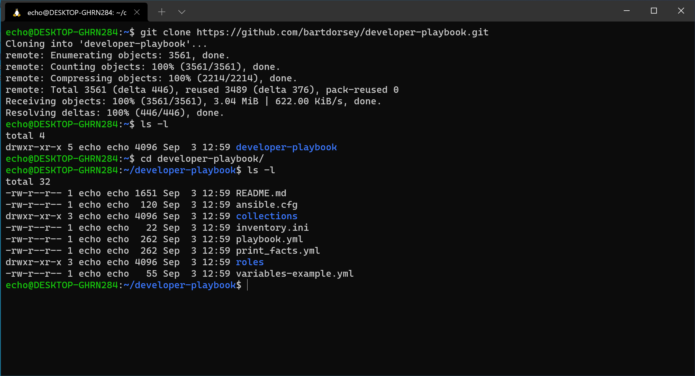
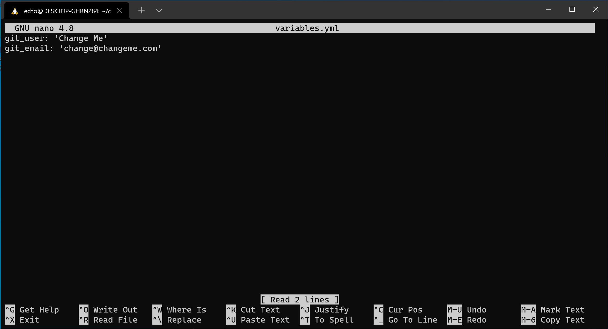
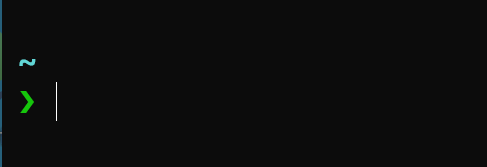

# Ansible Playbook

> Note: the screenshots in this section might look different between macOS and Windows with WSL, but the commands are the same.

An ansible playbook is a set of instructions for setting up a computer system.

Now we are going to clone the ansible playbook down so that ansible can
install all of our development tools.

We will use `git` to clone it to a folder on our computer.

At the shell prompt type the following command.

```sh
git clone https://github.com/bartdorsey/developer-playbook.git
```

Once this finished, there will be a new folder called "developer-playbook" created
in your home directory.

type `ls -l` and you should see this folder in the list

We need to navigate to this folder in the shell.

```sh
cd developer-playbook
```

> We use the `cd` (change directory) command to
> move around our computer's folder heirarchy (often called a file system)

You will notice your shell prompt changes to indicate you are now *in* the `developer-playbook` folder. Run `ls -l` again and you'll see the list of files
in this folder.



The file we are interested in is `variables-example.yml`

We need to open this file in an editor and change a few things. We'll be editing
files a lot in this class, and we'll usually use [Visual Studio Code] by Microsoft
to edit our code files. If you have VSCode already installed, you can use it to
edit this file, but for now, we can use a handy terminal based editor called `nano`.

First, we should copy this example file to the real file using the `cp` command.

```sh
cp variables-example.yml variables.yml
```

This makes a copy of the example file and names it `variables.yml`

Now edit it with nano (or your editor of choice)

```sh
nano variables.yml
```



In nano, you can use the arrow keys to move around in the file and type to change
things.  However you'll notice you can't move the cursor by clicking the mouse.
This is a terminal application! Keyboard only!

In any case, you'll want to edit the two lines in here:

```text
git_user: 'Change Me'
git_email: 'change@changeme.com'
```

Chane the user to your full name, and the email to your email address.

Then look at the bottom of nano, you'll see there's a bunch of keyboard shortcuts.

The `^` character means the control key, so use `^X` (Control-X) to exit.

Nano will ask you if you want to save the buffer (nano-speak for file) and what
filename you want, just keep it named `variables.yml`

## Running the playbook

Now we can run the following command to run the ansible playbook.

```sh
ansible-playbook -K playbook.yml
```

The first thing the playbook does is ask you for a `BECOMES` password.  This is
because ansible needs to `BECOME` the superuser in order to install some of the
software. Just type your macOS password here and press enter.

Then ansible attempts to install all the software.

Sit back and relax, this could take a while.


Once this is complete it should look something like this: (It might vary slightly between macOS and Windows)

## Restart your terminal

The last step is to close your terminal and reopen it, Once you've reopened it,
you should notice your prompt looks different. This is the [starship] prompt `>`,
and it can show you more information than just the folder you are in. (things like the node version of your project and information about your git branch.. Just trust us, this will be useful later.)



## Congratulations

You've now got all the software installed you need to be a real web developer!

Once you've got this completed you can move on an read about [extra resources]

[extra-resources]:extra-resources.md
[starship]:https://starship.rs
