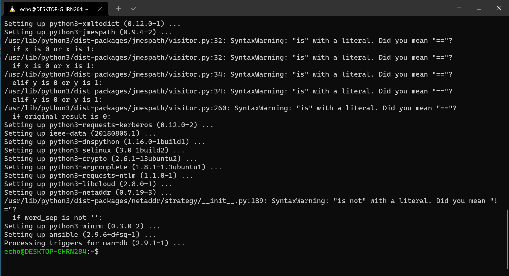

# [Ansible] installation

This guide uses [Ansible](https://ansible.com) to automate installation of the
development tools you'll need.

[Ansible] is an IT Automation tool usually used for Linux servers. We don't need to know how ansible works, you'l just
install Ansible and run an ansible playbook to install the rest of the development tools we need.

The ansible playbook we've created installs the following tools:

At the command line:

- [zsh] - If you didn't already have it, your default shell will now be zsh.
- [nvm] - The node version manager, a program to help you manage different node
versions
- [Node.JS] - A JavaScript code runner, we'll be using this to run our JavaScript
- [zip and unzip] - Command line utilities to compress and uncompress zip files.
- [htop] - A nice way to view all the programs running on your computer from the terminal
- [pgcli] - A fancy postgres command line interface
- [starship] - A fancy replacment shell prompt which shows you lots of interesting information about your node version and information about your git repos.

And running as a background program:

- [PostgreSQL] - A database server we'll use to store data for our applications

## Installation of Ansible

So first thing we should do is to install ansible itself.

First type this command into your shell to cause Linux's package manager `apt` to update it's indexes of available software.

```shell
sudo apt update
```

This will prompt you for your linux password in order to become the super  user. (this is what `sudo` does)

Then we can run the rest of these commands one at a time to install ansible without having to type the password again.

This installs a dependency that ansible needs:

```shell
sudo apt install -y software-properties-common
```

This adds the ansible repository to apt:

```shell
sudo add-apt-repository --yes --update ppa:ansible/ansible
```

And finally this installs ansible:

```shell
sudo apt install -y ansible
```



Once you've got this done, move on to [Running the Ansible Playbook]

[Ansible]:https://ansible.com
[Running the Ansible Playbook]:ansible-playbook-setup.md
